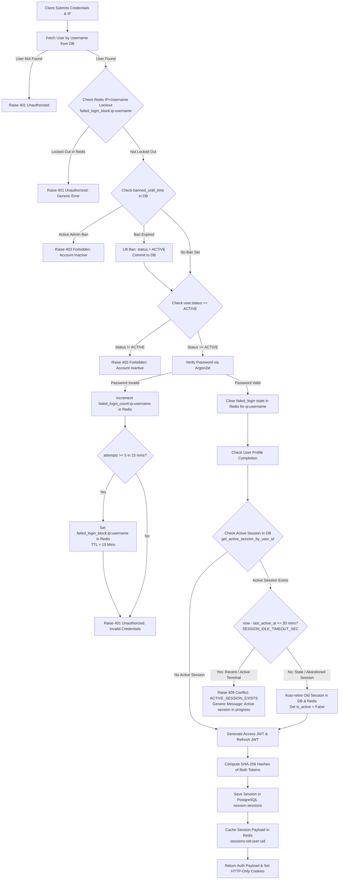

# Authentication & Token Lifecycle Logic Flow

## User Login & IP-Scoped ABAC Lockout Flowchart
This flowchart details credential verification, Argon2id check, IP+Username brute-force lockout, and initial session creation:



---

## Session Termination & Administrative Overrides Flowchart

```mermaid
flowchart TD
    subgraph OwnSessionLogout["User Own Logout: POST /api/private/session/logout"]
        A1[Extract user_id & session_id from request.state] --> B1[Deactivate Session in PostgreSQL: is_active=False]
        B1 --> C1[Delete Redis Cache Key: sessions:sid:user:uid]
        C1 --> D1[Remove from User Session Set in Redis]
        D1 --> E1[Delete access_token & refresh_token Cookies]
        E1 --> F1[Return 200 OK: Session Terminated]
    end

    subgraph AdminSingleLogout["Admin Force Logout by Session UUID: DELETE /api/private/admin/sessions/{session_id}"]
        A2[Admin Request guarded by require_role SUPER_ADMIN, ADMIN] --> B2[Fetch Session by session_id]
        B2 -->|Not Found| C2[Raise 404 NotFoundException]
        B2 -->|Already Inactive| D2[Raise 400 BadRequestException]
        B2 -->|Active Session| E2[Deactivate Session in DB: is_active=False]
        E2 --> F2[Evict Session Key & SREM from Redis]
        F2 --> G2[Return 200 OK: Terminal Force-Revoked]
    end

    subgraph AdminMassLogout["Admin Mass Logout: POST /api/private/admin/users/{user_id}/sessions/terminate-all"]
        A3[Admin Request guarded by require_role SUPER_ADMIN, ADMIN] --> B3[Step-Up Sudo Guard: verify_sudo_credential]
        B3 -->|Password Mismatch| C3[Raise 401 Unauthorized: INVALID_ADMIN_CREDENTIALS]
        B3 -->|Password Valid| D3[Bulk DB Update: SET is_active=False WHERE user_id=:id]
        D3 --> E3[Fetch All Session Keys from Redis Set: user_sessions:uid]
        E3 --> F3[Delete All Session Keys & Set from Redis]
        F3 --> G3[Return 200 OK: Revoked Count Reported]
    end
```



---

## Admin User Registration Approval Lifecycle (BIR CAS Annex B Item 11.a)

```mermaid
flowchart TD
    A[Public Registration: POST /api/public/auth/registration] --> B[Save User in DB with status = PENDING]
    B --> C[User Attempting Login is Blocked with 403 Forbidden: Account Inactive]
    
    D[Admin Lists Pending: GET /api/private/admin/users/pending] --> E[Guarded by require_permission AUTHENTICATION_USER_READ]
    E --> F[Returns List of Pending Users with registration timestamp]
    
    G[Admin Approves: POST /api/private/admin/users/{user_id}/approve] --> H[Guarded by require_permission AUTHENTICATION_REGISTRATION_ACCEPT]
    H --> I{User exists & status == PENDING?}
    I -->|No| J[Raise 404 or 400 Exception]
    I -->|Yes| K[Set status = ACTIVE in DB]
    K --> L[Assign Initial Role default: STAFF_USER]
    L --> M[Commit Transaction & Return 200 OK]
    
    N[Admin Rejects: POST /api/private/admin/users/{user_id}/reject] --> O[Guarded by require_permission AUTHENTICATION_REGISTRATION_REJECT]
    O --> P{User exists & status == PENDING?}
    P -->|No| Q[Raise 404 or 400 Exception]
    P -->|Yes| R[Set status = INACTIVE in DB]
    R --> S[Commit Transaction & Return 200 OK<br/>Record Retained for 10-Yr BIR Audit Trail]
```