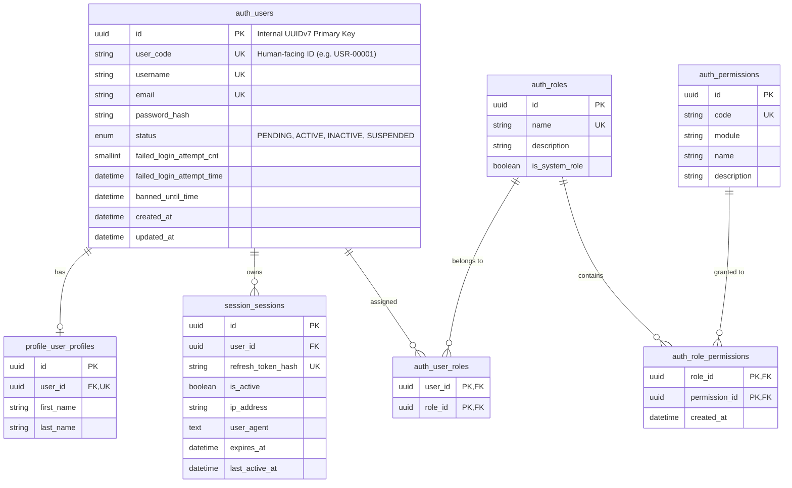

# Hybrid RBAC + ABAC Authorization Model

The authorization model evaluates both **static roles/permissions** and **dynamic contextual attributes**:

---

## Dual-Identifier Architecture

The platform separates machine-level database operations from human interaction surfaces:

1. **Internal Identifier (`id: UUID`)**:
   - Time-ordered **UUIDv7** primary key.
   - Used for all foreign keys, relational joins, JWT subject claims (`sub`), and internal Redis cache keys.
   - Never intended for human typing, verbal referencing, or document printing.

2. **User-Facing Identifier (`user_code: VARCHAR(20)`)**:
   - Monotonically increasing sequential code formatted with leading zero padding (`USR-00001`).
   - Powered by PostgreSQL sequence `auth.user_code_seq` (`server_default`).
   - Aligns with **BIR CAS sequential numbering rules** (*Annex B Lines 17, 188*).
   - Displayed exclusively on human-facing surfaces: admin session tables, user registration approvals, profile views, printed accounting audit reports, and user-facing search lookups.

